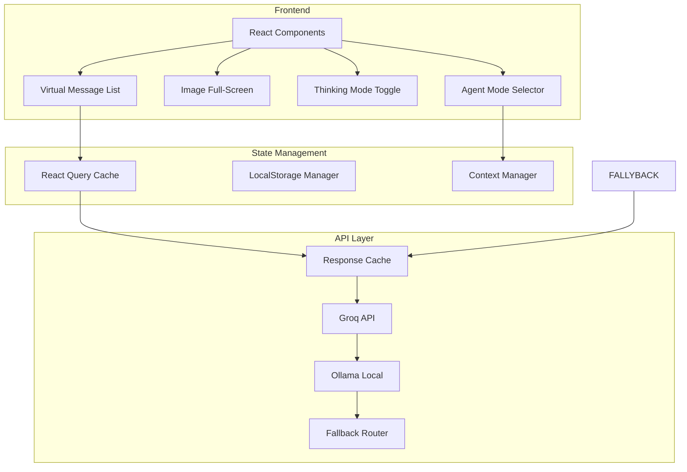

# Senko AI - Comprehensive Improvement Plan

## Executive Summary

Based on my analysis of the codebase, I've identified several key areas that need improvement to address your concerns about performance, visual design, conversational capabilities, and missing features. This plan provides a structured approach to resolving these issues.

---

## 1. Performance Optimization

### 1.1 API Response Time Improvements

**Current State:**
- Chat API uses Groq streaming (fast inference ~500 tok/s)
- Fallback cascade: Groq primary → Groq fallback models → Ollama
- No response caching or memoization

**Proposed Improvements:**
1. **Response Caching Layer**
   - Implement Redis-style caching for common queries (facts, definitions)
   - Cache key: hash(userQuery + conversationContext)
   - TTL: 1 hour for informational queries, 24h for factual answers

2. **Streaming Optimization**
   - Add compression middleware for response streams
   - Implement chunked encoding for faster client consumption

3. **Connection Pooling**
   - Pre-establish connections to Groq API during idle periods
   - Reduce TLS handshake overhead for subsequent requests

### 1.2 Frontend Performance

**Current State:**
- All conversation history stored in localStorage
- No lazy loading for components
- Large render cycles on every message

**Proposed Improvements:**
1. **Virtual Scrolling**
   - Implement `react-virtual` for chat message rendering
   - Only render visible messages + buffer (e.g., 20 messages)
   - Reduces DOM nodes from hundreds to dozens

2. **State Management Optimization**
   - Use React Query/TanStack Query for server state
   - Implement optimistic updates for immediate UI feedback
   - Memoize expensive computations with `useMemo` and `useCallback`

3. **LocalStorage Management**
   - Implement conversation archiving (move old convos to archive)
   - Limit active conversation to last 50 messages
   - Compress stored data using LZ-string

---

## 2. Visual Design & UI Improvements

### 2.1 Image & Media Embeds

**Current Issues:**
- Image carousel uses fixed height (`h-48` = 192px)
- No full-screen expansion
- Small navigation arrows

**Proposed Improvements:**
```typescript
// Enhanced ImageCarousel with full-screen modal
interface ImageCarouselProps {
  images: MessageImage[];
  enableFullscreen?: boolean; // default: true
  maxHeight?: "sm" | "md" | "lg" | "xl"; // responsive sizes
  showCaptions?: boolean;
}
```

**New Features:**
- Click-to-expand full-screen modal with backdrop blur
- Touch gestures (swipe, pinch) for mobile
- Zoom capability (1x to 3x)
- Keyboard navigation (arrow keys, escape to close)
- Image metadata display (dimensions, source URL)
- "Copy image link" option

### 2.2 Design System Consistency

**Current State:**
- Mixed usage of CSS variables and hardcoded colors
- Some components use Tailwind classes inconsistently
- Glass morphism effects are applied unevenly

**Proposed Improvements:**
1. **Unified Design Tokens**
   ```css
   /* Complete design token system */
   :root {
     /* Semantic colors */
     --color-primary: var(--senko-accent);
     --color-primary-dim: var(--senko-accent-dim);
     --color-success: #10b981;
     --color-warning: #f59e0b;
     --color-error: #ef4444;
     
     /* Spacing scale */
     --space-1: 0.25rem;
     --space-2: 0.5rem;
     --space-3: 0.75rem;
     --space-4: 1rem;
     --space-6: 1.5rem;
     --space-8: 2rem;
     
     /* Typography scale */
     --text-xs: 0.75rem;
     --text-sm: 0.875rem;
     --text-base: 1rem;
     --text-lg: 1.125rem;
     --text-xl: 1.25rem;
     
     /* Animation timing */
     --transition-fast: 150ms ease;
     --transition-base: 200ms ease;
     --transition-slow: 300ms ease;
   }
   ```

2. **Component Library Updates**
   - Create reusable `SenkoCard`, `SenkoButton`, `SenkoInput` components
   - Consistent border-radius: `--radius-lg` = 0.75rem
   - Unified hover/focus states across all interactive elements

3. **Layout Streamlining**
   - Reduce visual clutter in sidebar
   - Implement collapsible sections
   - Add clear visual hierarchy with consistent spacing

---

## 3. Conversational & Logical Capabilities

### 3.1 Context Management

**Current Issues:**
- 300+ line system prompt (too long, may cause token waste)
- No explicit context window optimization
- Difficult for AI to maintain coherent multi-step reasoning

**Proposed Improvements:**
1. **System Prompt Optimization**
   - Reduce to ~100 lines of essential directives
   - Move examples to separate knowledge base
   - Implement prompt versioning

2. **Context Summarization**
   ```typescript
   interface ConversationContext {
     summary: string; // 2-3 sentence summary of conversation
     keyTopics: string[]; // 3-5 main topics discussed
     userPreferences: Record<string, string>;
     lastActionStatus: "success" | "pending" | "failed";
   }
   ```

3. **Multi-Step Query Handling**
   - Implement task decomposition: "Let me break this down..."
   - Add step tracking: "Step 1/3: Researching..."
   - Enable natural mid-task corrections

### 3.2 Thinking Mode

**Current State:**
- Thinking indicators exist but are minimal (pulsing dots)

**Proposed Improvements:**
1. **Expandable Thinking Mode**
   - Toggle button in chat header: "Show Thinking"
   - Displays internal reasoning process:
     ```
     [Thinking Process]
     1. Analyzing user's question about X...
     2. Breaking this into sub-questions:
        - What is X?
        - How does X affect Y?
     3. Planning search strategy...
     ```
   - Animated thinking visualization
   - Collapsible sections

2. **Transparency Features**
   - Show confidence levels for answers
   - Display sources used for each claim
   - Add "uncertainty" indicators when appropriate

---

## 4. Ollama Integration Fix

### 4.1 Current Issues

**Current State:**
- `ollama.ts` file marked as deprecated
- Detection only via `/api/tags` endpoint
- No UI configuration options
- Hardcoded model: `mistral`

**Proposed Improvements:**
```typescript
// New ollama-config.ts
interface OllamaConfig {
  enabled: boolean;
  baseUrl: string;
  model: string;
  temperature: number;
  contextSize: number;
}

interface OllamaModel {
  name: string;
  size: number;
  modified: string;
}
```

**New Features:**
1. **UI Configuration Panel**
   - Toggle Ollama on/off
   - Dropdown to select available models
   - Connection health check with visual indicator
   - Manual URL input with validation

2. **Robust Detection**
   ```typescript
   async function detectOllama(): Promise<OllamaHealthStatus> {
     const checks = await Promise.allSettled([
       fetch(`${url}/api/tags`),
       fetch(`${url}/api/version`),
     ]);
     // Handle various failure modes
   }
   ```

3. **Model Management**
   - Pull new models from UI
   - Display model sizes and storage info
   - Delete unused models

---

## 5. Missing Features Implementation

### 5.1 Agent Modes

**Current State:**
- No explicit agent mode selection
- All requests handled uniformly

**Proposed Improvements:**
1. **Mode Selection UI**
   ```typescript
   type AgentMode = 
     | 'general'      // Standard chat
     | 'research'     // Deep web search & analysis
     | 'coding'       // Code-focused assistance
     | 'creative'     // Writing & creative tasks
     | 'debug'        // Systematic debugging
     | 'analysis';    // Data & document analysis
   ```

2. **Mode-Specific System Prompts**
   - Research mode: Enhanced search directives, source citation focus
   - Coding mode: Language-specific expertise, code execution awareness
   - Creative mode: More imaginative responses, fewer restrictions

3. **Mode Switching**
   - Dropdown in chat header
   - Visual indicator of current mode
   - Quick-switch toolbar

### 5.2 Enhanced Settings Panel

**Current State:**
- Settings limited to: font size, send with enter, permissions
- No AI model selection
- No appearance customization

**Proposed Improvements:**
```typescript
interface ExtendedSettings {
  // Appearance
  theme: 'dark' | 'light' | 'system';
  compactMode: boolean;
  animations: 'full' | 'reduced' | 'minimal';
  
  // AI Preferences
  defaultMode: AgentMode;
  modelPreference: 'groq' | 'ollama' | 'auto';
  temperature: number;
  maxTokens: number;
  
  // Privacy
  showThinking: boolean;
  autoArchiveDays: number;
  shareDiagnostics: boolean;
}
```

---

## 6. Filter & Restriction Review

### 6.1 Current Restrictions Analysis

**Identified Areas:**
- Hardcoded rules in system prompt
- No user-configurable boundaries
- One-size-fits-all approach

**Proposed Improvements:**
1. **User-Adjustable Filters**
   ```
   Filter Settings:
   ┌─────────────────────────────────────────┐
   │ [✓] Safe for Work Mode                   │
   │ [✓] Block explicit content              │
   │ [ ] Allow mature topics (educational)   │
   │ [ ] Enable code execution sandbox       │
   └─────────────────────────────────────────┘
   ```

2. **Transparent Restrictions**
   - Explain why content was filtered
   - Provide alternative suggestions
   - Allow "override with reason" for edge cases

---

## 7. Implementation Roadmap

### Phase 1: Foundation (1-2 weeks)
- [ ] Implement virtual scrolling for chat
- [ ] Add image full-screen modal
- [ ] Create unified design token system
- [ ] Optimize system prompt

### Phase 2: Core Features (2-3 weeks)
- [ ] Build response caching layer
- [ ] Implement thinking mode
- [ ] Fix Ollama integration with UI
- [ ] Add agent mode selection

### Phase 3: Polish (1-2 weeks)
- [ ] Enhance settings panel
- [ ] Add accessibility improvements
- [ ] Performance optimization
- [ ] User feedback integration

---

## 8. Files to Modify

| File | Changes |
|------|---------|
| `src/components/chat/image-carousel.tsx` | Add full-screen modal, gestures |
| `src/components/chat/chat-area.tsx` | Virtual scrolling, mode selector |
| `src/app/globals.css` | Design tokens, consistency |
| `src/lib/config.ts` | Enhanced configuration |
| `src/lib/ollama.ts` | Rewrite with full integration |
| `src/components/sidebar/settings-panel.tsx` | Extended settings |
| `src/app/page.tsx` | Thinking mode, agent modes |
| `src/app/api/chat/route.ts` | Caching, optimization |

---

## 9. Mermaid: System Architecture After Improvements



---

## Next Steps

1. **Review and Approve**: Please review this plan and provide feedback
2. **Prioritization**: Confirm which improvements take priority
3. **Implementation**: Switch to Code mode to begin implementation

---

*Plan generated: 2026-02-10*
*Senko AI Improvement Initiative*
